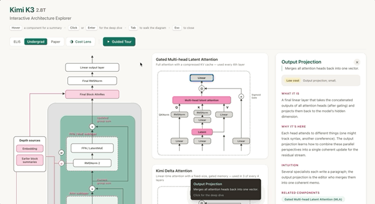
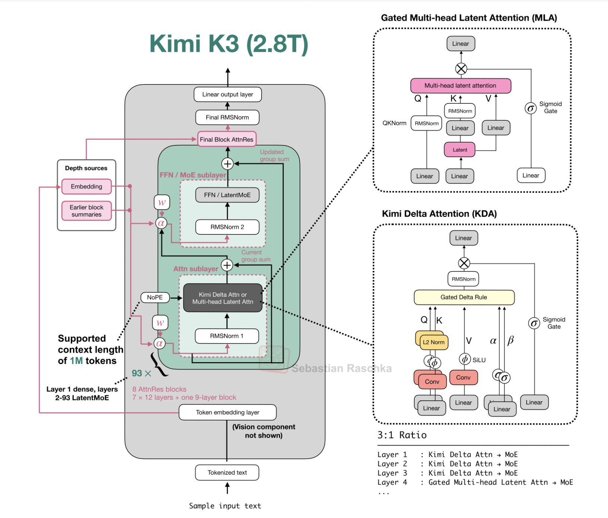

# Kimi K3 — Interactive Architecture Explorer

[](https://campagc.github.io/kimi-k3-explorer/)

An interactive, click-to-explore walkthrough of the **Kimi K3 (2.8T)** language-model architecture, recreated as an explorable SVG diagram in a single-page React app.

**🚀 Live demo:** [https://campagc.github.io/kimi-k3-explorer/](https://campagc.github.io/kimi-k3-explorer/)



Every labelled component in the diagram is a live hotspot:

- **Hover** any component for a quick summary, **click** for a deep dive
- **Fully keyboard-navigable** `Tab` walks the diagram, `Enter` opens the detail panel
- **Three explanation levels** - ELI5 · Undergrad · Paper - switchable at any time
- **Guided tour** 23 curated stops through the whole network (`←` / `→` to navigate)
- **Cost lens** colour-codes every component by per-token compute/memory cost

## Credits

The diagram this app recreates interactively is the **Kimi K3 architecture figure by
[Sebastian Raschka](https://sebastianraschka.com)**, from his
[LLM Architecture Gallery](https://sebastianraschka.com/llm-architecture-gallery/)
([Kimi K3 card](https://sebastianraschka.com/llm-architecture-gallery/#card-kimi-k3)).
All credit for the original figure goes to him



*Original figure © Sebastian Raschka, shared here with attribution. The Kimi K3 model
itself is developed by [Moonshot AI](https://www.moonshot.ai/).*

## Getting started

**Prerequisites:** [Node.js](https://nodejs.org) ≥ 18 and npm.

```bash
git clone https://github.com/campagc/kimi-k3-explorer.git
cd kimi-k3-explorer
npm install
npm run dev
```

Then open [http://localhost:5173](http://localhost:5173).
